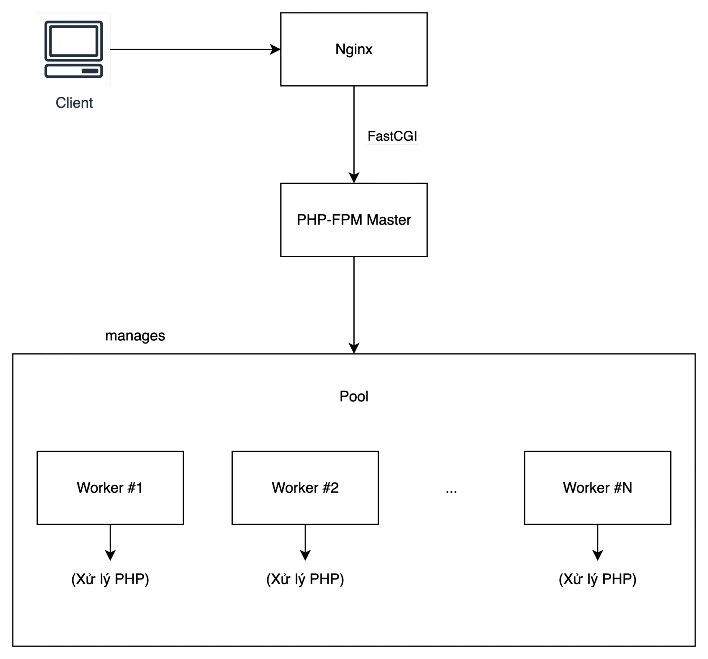
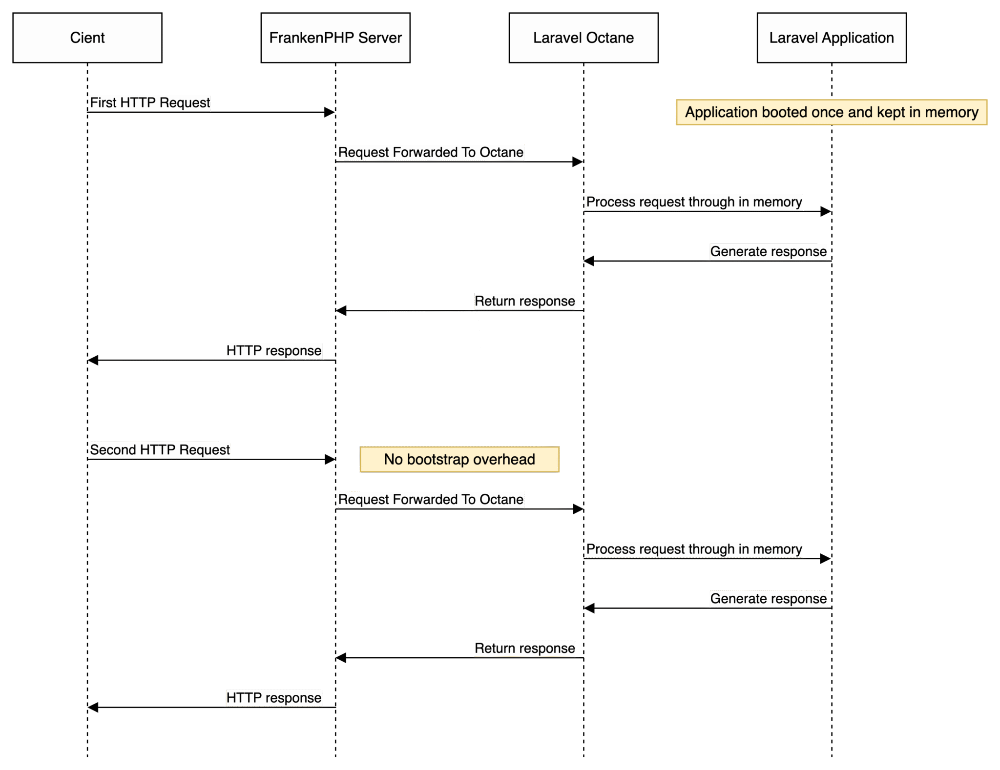

# PHP test performance

## I. PHP-FPM
### 1. Khái niệm PHP-FPM
- PHP-FPM (FastCGI Process Manager) là một FastCGI implementation để chạy PHP.
- Ý tưởng chính: thay vì tạo một process PHP mới cho mỗi request (như CGI), PHP-FPM giữ sẵn một pool các worker PHP.
- Web server (Nginx, Apache) gửi request đến PHP-FPM thông qua FastCGI protocol.
### 2. Kiến trúc


- Master process
	- Khởi tạo và quản lý các worker.
	- Theo dõi worker: restart nếu crash hoặc hết memory.
	- Thay đổi cấu hình pool khi cần.
- Worker process (PHP-FPM pool):
	- Xử lý request PHP
	- Thường có nhiều worker chạy đồng thời.
	- Config: `/usr/local/etc/php-fpm.d/www.conf`
		- `pm` → process manager
			- Có 3 chế độ chính để quản lý worker process
				- `pm = static`: Luôn tạo ra cố định số worker đúng bằng pm.max_children
				- `pm = dynamic`: Số worker tăng/giảm linh hoạt theo nhu cầu
				- `pm = ondemand`: Chỉ tạo worker khi có request, và worker tự die sau khi idle đủ lâu (`pm.process_idle_timeout`).
		-	`pm.max_children` → số worker tối đa.
			- Giới hạn tối đa số worker process có thể được tạo ra.
			- Ví dụ: Nếu có 100 request đồng thời nhưng `max_children = 30`, thì chỉ tối đa 30 request được xử lý song song.
			- 70 request còn lại sẽ phải đẩy vào queue, chờ đến khi có worker rảnh.
		- `pm.start_servers` → Số worker được tạo ngay khi service PHP-FPM khởi động
		- `pm.min_spare_servers` → Số worker rảnh tối thiểu mà PHP-FPM cố gắng duy trì.
		- `pm.max_spare_servers` → Số worker rảnh tối đa mà PHP-FPM cho phép tồn tại.
		- `pm.max_requests` → số request mỗi worker xử lý trước khi restart.
	- Default config:
		```
		pm = dynamic
		pm.max_children = 5
		pm.start_servers = 2
		pm.min_spare_servers = 1
		pm.max_spare_servers = 3
		```
- Web server:
	- Như Nginx hoặc Apache.
	- Không xử lý PHP trực tiếp.
	- Gửi request PHP đến PHP-FPM qua FastCGI socket (TCP hoặc Unix socket).
- Khi request tới:
	- (1) Web server nhận HTTP request.
	- (2) Nếu là PHP request, gửi tới PHP-FPM.
	- (3) Master process chọn worker rảnh.
	- (4) Worker thực thi PHP, trả về kết quả.
	- (5) Worker sẵn sàng nhận request tiếp theo.

## II. FrankenPHP
### 1. Vấn đề của PHP-FPM
- PHP-FPM sinh ra để tách PHP engine ra khỏi web server (Nginx, Apache).
- Nghĩa là PHP không tự “nghe” HTTP request được, mà phải có 1 web server đứng trước làm cầu nối.

### 2. FrankenPHP khác gì?
FrankenPHP là một application server viết bằng Caddy (Go) + PHP (embedded runtime).

Nó cắt bỏ FastCGI trung gian, nghĩa là không cần Nginx/Apache làm proxy nữa.

FrankenPHP có thể:
- Nghe trực tiếp HTTP/HTTPS (port 80, 443).
- Nhận request, chạy PHP script ngay trong process của nó.
- Hỗ trợ cả Worker Mode (giữ PHP runtime sống giữa các request, giống Node.js) → nhanh hơn PHP-FPM truyền thống vốn “stateless”.
### 3. Kiến trúc
a. Các thành phần chính
- Caddy (HTTP Server)
	- FrankenPHP được build dựa trên Caddy, nên nó có đầy đủ tính năng reverse proxy, TLS, HTTP/3, load balancing…
	- Caddy chịu trách nhiệm nhận request HTTP từ client.
- FrankenPHP Layer (Bridge giữa Caddy và PHP)
	- Thay vì gửi request sang PHP-FPM qua FastCGI (như Nginx/Apache), FrankenPHP nhúng trực tiếp PHP runtime.
	- Điều này giúp loại bỏ FastCGI overhead.
- PHP Runtime (Embedded)
	- PHP interpreter được nhúng thẳng vào FrankenPHP.
	- Có thể chạy:
		- Classic PHP mode: mỗi request sinh ra 1 process/worker mới (giống PHP-FPM).
		- Worker mode: giữ process PHP sống lâu → tái sử dụng object, giảm chi phí bootstrapping (tương tự Node.js hoặc Swoole).
- Worker System (Request Handling)
	- Bạn có thể định nghĩa worker.php hoặc dùng Laravel Octane.
	- Worker sống lâu trong memory, xử lý nhiều request thay vì chết đi sau mỗi request.
b. Laravel Octane
- Vấn đề của Laravel khi chạy truyền thống (PHP-FPM)
	- Mỗi HTTP request đến → Laravel phải:
		- (1) Load autoload (Composer).
		- (2) Load config.
		- (3) Boot service providers.
		- (4) Tạo container, middleware, routes.
		- (5) Xử lý request → trả về response.
		- (6) Xong rồi thì huỷ hết. Request sau lại làm lại từ đầu.
		
		👉 Tốn CPU & RAM, làm giảm tốc độ khi request nhiều.
- Cách Octane giải quyết
	- Octane chạy Laravel trong Worker Mode:
	- Giữ ứng dụng Laravel luôn sống trong bộ nhớ (container, configs, routes…).
	- Khi có request mới → chỉ tái sử dụng app đã load sẵn → xử lý nhanh hơn nhiều lần.




## III. Demo
- Stress test: K6
- Kịch bản test: Kiểm tra chịu tải và thời gian xử lý của server khi có đồng thời 100 user cùng gửi request đến
- Cấu hình: Sử dụng docker chạy dưới local, có giới hạn CPU, RAM sử dụng
	- Server chạy ứng dụng: 2 - cpus, 2gb - memory limit
	- Database: 2 - cpus, 4gb - memory limit

### 1. PHP-FPM
<video src="./docs/Test-PHP-FPM.mp4"></video>

```bash
k6 run Stress_Test_PHP_FPM.js
```

```bash
         /\      Grafana   /‾‾/  
    /\  /  \     |\  __   /  /   
   /  \/    \    | |/ /  /   ‾‾\ 
  /          \   |   (  |  (‾)  |
 / __________ \  |_|\_\  \_____/ 

     execution: local
        script: Stress_Test_PHP_FPM.js
        output: -

     scenarios: (100.00%) 1 scenario, 100 max VUs, 31s max duration (incl. graceful stop):
              * default: 100 looping VUs for 1s (gracefulStop: 30s)


  █ TOTAL RESULTS 

    HTTP
    http_req_duration.......................................................: avg=11.26s min=2.42s med=10.12s max=18.54s p(90)=18.54s p(95)=18.54s
      { expected_response:true }............................................: avg=11.26s min=2.42s med=10.12s max=18.54s p(90)=18.54s p(95)=18.54s
    http_req_failed.........................................................: 0.00%  0 out of 100
    http_reqs...............................................................: 100    5.114694/s

    EXECUTION
    iteration_duration......................................................: avg=12.26s min=3.43s med=11.12s max=19.54s p(90)=19.54s p(95)=19.54s
    iterations..............................................................: 100    5.114694/s
    vus.....................................................................: 12     min=12       max=100
    vus_max.................................................................: 100    min=100      max=100

    NETWORK
    data_received...........................................................: 115 kB 5.9 kB/s
    data_sent...............................................................: 8.2 kB 419 B/


running (19.6s), 000/100 VUs, 100 complete and 0 interrupted iterations
default ✓ [======================================] 100 VUs  1s
```

```log
[2025-09-20 17:40:06] local.INFO: [db-benchmark] Time: 2.34 s  
[2025-09-20 17:40:06] local.INFO: [db-benchmark] Time: 2.33 s  
[2025-09-20 17:40:06] local.INFO: [db-benchmark] Time: 2.33 s  
[2025-09-20 17:40:06] local.INFO: [db-benchmark] Time: 2.33 s  
[2025-09-20 17:40:06] local.INFO: [db-benchmark] Time: 2.33 s  
[2025-09-20 17:40:06] local.INFO: [db-benchmark] Time: 2.33 s  
[2025-09-20 17:40:06] local.INFO: [db-benchmark] Time: 2.33 s  
[2025-09-20 17:40:06] local.INFO: [db-benchmark] Time: 2.33 s  
[2025-09-20 17:40:06] local.INFO: [db-benchmark] Time: 2.36 s  
[2025-09-20 17:40:06] local.INFO: [db-benchmark] Time: 2.33 s  
[2025-09-20 17:40:06] local.INFO: [db-benchmark] Time: 1.73 s  
[2025-09-20 17:40:08] local.INFO: [db-benchmark] Time: 2.51 s  
[2025-09-20 17:40:08] local.INFO: [db-benchmark] Time: 2.52 s  
[2025-09-20 17:40:09] local.INFO: [db-benchmark] Time: 2.92 s  
[2025-09-20 17:40:09] local.INFO: [db-benchmark] Time: 3 s  
[2025-09-20 17:40:09] local.INFO: [db-benchmark] Time: 2.99 s  
[2025-09-20 17:40:09] local.INFO: [db-benchmark] Time: 2.92 s  
[2025-09-20 17:40:09] local.INFO: [db-benchmark] Time: 3 s  
[2025-09-20 17:40:09] local.INFO: [db-benchmark] Time: 3 s  
[2025-09-20 17:40:09] local.INFO: [db-benchmark] Time: 3 s  
[2025-09-20 17:40:09] local.INFO: [db-benchmark] Time: 3 s  
[2025-09-20 17:40:09] local.INFO: [db-benchmark] Time: 3 s  
[2025-09-20 17:40:09] local.INFO: [db-benchmark] Time: 3 s  
[2025-09-20 17:40:09] local.INFO: [db-benchmark] Time: 3.07 s  
[2025-09-20 17:40:10] local.INFO: [db-benchmark] Time: 3.87 s  
[2025-09-20 17:40:10] local.INFO: [db-benchmark] Time: 3.87 s  
[2025-09-20 17:40:10] local.INFO: [db-benchmark] Time: 3.87 s  
[2025-09-20 17:40:10] local.INFO: [db-benchmark] Time: 3.87 s  
[2025-09-20 17:40:12] local.INFO: [db-benchmark] Time: 5.02 s  
[2025-09-20 17:40:12] local.INFO: [db-benchmark] Time: 5.02 s  
[2025-09-20 17:40:12] local.INFO: [db-benchmark] Time: 5.02 s  
[2025-09-20 17:40:12] local.INFO: [db-benchmark] Time: 5.02 s  
[2025-09-20 17:40:12] local.INFO: [db-benchmark] Time: 5.02 s  
[2025-09-20 17:40:13] local.INFO: [db-benchmark] Time: 5.42 s  
[2025-09-20 17:40:13] local.INFO: [db-benchmark] Time: 5.03 s  
[2025-09-20 17:40:13] local.INFO: [db-benchmark] Time: 5.03 s  
[2025-09-20 17:40:13] local.INFO: [db-benchmark] Time: 5.1 s  
[2025-09-20 17:40:13] local.INFO: [db-benchmark] Time: 5.1 s  
[2025-09-20 17:40:13] local.INFO: [db-benchmark] Time: 5.5 s  
[2025-09-20 17:40:13] local.INFO: [db-benchmark] Time: 4.51 s  
[2025-09-20 17:40:13] local.INFO: [db-benchmark] Time: 4.5 s  
[2025-09-20 17:40:13] local.INFO: [db-benchmark] Time: 4.52 s  
[2025-09-20 17:40:13] local.INFO: [db-benchmark] Time: 4.5 s  
[2025-09-20 17:40:13] local.INFO: [db-benchmark] Time: 4.65 s  
[2025-09-20 17:40:13] local.INFO: [db-benchmark] Time: 4.58 s  
[2025-09-20 17:40:13] local.INFO: [db-benchmark] Time: 4.58 s  
[2025-09-20 17:40:13] local.INFO: [db-benchmark] Time: 4.6 s  
[2025-09-20 17:40:13] local.INFO: [db-benchmark] Time: 4.58 s  
[2025-09-20 17:40:13] local.INFO: [db-benchmark] Time: 4.58 s  
[2025-09-20 17:40:13] local.INFO: [db-benchmark] Time: 4.6 s  
[2025-09-20 17:40:13] local.INFO: [db-benchmark] Time: 5.4 s  
[2025-09-20 17:40:15] local.INFO: [db-benchmark] Time: 6.12 s  
[2025-09-20 17:40:15] local.INFO: [db-benchmark] Time: 6.11 s  
[2025-09-20 17:40:15] local.INFO: [db-benchmark] Time: 6.12 s  
[2025-09-20 17:40:16] local.INFO: [db-benchmark] Time: 5.68 s  
[2025-09-20 17:40:16] local.INFO: [db-benchmark] Time: 5.68 s  
[2025-09-20 17:40:16] local.INFO: [db-benchmark] Time: 5.68 s  
[2025-09-20 17:40:16] local.INFO: [db-benchmark] Time: 5.68 s  
[2025-09-20 17:40:18] local.INFO: [db-benchmark] Time: 5.79 s  
[2025-09-20 17:40:18] local.INFO: [db-benchmark] Time: 5.79 s  
[2025-09-20 17:40:18] local.INFO: [db-benchmark] Time: 5.79 s  
[2025-09-20 17:40:18] local.INFO: [db-benchmark] Time: 5.79 s  
[2025-09-20 17:40:18] local.INFO: [db-benchmark] Time: 4.89 s  
[2025-09-20 17:40:18] local.INFO: [db-benchmark] Time: 5.19 s  
[2025-09-20 17:40:18] local.INFO: [db-benchmark] Time: 4.89 s  
[2025-09-20 17:40:18] local.INFO: [db-benchmark] Time: 5.2 s  
[2025-09-20 17:40:18] local.INFO: [db-benchmark] Time: 4.89 s  
[2025-09-20 17:40:18] local.INFO: [db-benchmark] Time: 6.19 s  
[2025-09-20 17:40:18] local.INFO: [db-benchmark] Time: 5.19 s  
[2025-09-20 17:40:18] local.INFO: [db-benchmark] Time: 4.89 s  
[2025-09-20 17:40:18] local.INFO: [db-benchmark] Time: 5.2 s  
[2025-09-20 17:40:18] local.INFO: [db-benchmark] Time: 4.89 s  
[2025-09-20 17:40:18] local.INFO: [db-benchmark] Time: 5.19 s  
[2025-09-20 17:40:18] local.INFO: [db-benchmark] Time: 5.2 s  
[2025-09-20 17:40:18] local.INFO: [db-benchmark] Time: 4.9 s  
[2025-09-20 17:40:19] local.INFO: [db-benchmark] Time: 5.41 s  
[2025-09-20 17:40:19] local.INFO: [db-benchmark] Time: 5.42 s  
[2025-09-20 17:40:19] local.INFO: [db-benchmark] Time: 5.48 s  
[2025-09-20 17:40:19] local.INFO: [db-benchmark] Time: 5.48 s  
[2025-09-20 17:40:20] local.INFO: [db-benchmark] Time: 6.68 s  
[2025-09-20 17:40:21] local.INFO: [db-benchmark] Time: 5.36 s  
[2025-09-20 17:40:21] local.INFO: [db-benchmark] Time: 6.99 s  
[2025-09-20 17:40:21] local.INFO: [db-benchmark] Time: 5.36 s  
[2025-09-20 17:40:21] local.INFO: [db-benchmark] Time: 5.36 s  
[2025-09-20 17:40:21] local.INFO: [db-benchmark] Time: 5.3 s  
[2025-09-20 17:40:21] local.INFO: [db-benchmark] Time: 5.3 s  
[2025-09-20 17:40:21] local.INFO: [db-benchmark] Time: 5.3 s  
[2025-09-20 17:40:21] local.INFO: [db-benchmark] Time: 5.3 s  
[2025-09-20 17:40:22] local.INFO: [db-benchmark] Time: 3.42 s  
[2025-09-20 17:40:22] local.INFO: [db-benchmark] Time: 3.42 s  
[2025-09-20 17:40:22] local.INFO: [db-benchmark] Time: 3.5 s  
[2025-09-20 17:40:22] local.INFO: [db-benchmark] Time: 3.82 s  
[2025-09-20 17:40:22] local.INFO: [db-benchmark] Time: 3.89 s  
[2025-09-20 17:40:22] local.INFO: [db-benchmark] Time: 3.42 s  
[2025-09-20 17:40:22] local.INFO: [db-benchmark] Time: 3.89 s  
[2025-09-20 17:40:22] local.INFO: [db-benchmark] Time: 3.42 s  
[2025-09-20 17:40:22] local.INFO: [db-benchmark] Time: 3.5 s  
[2025-09-20 17:40:22] local.INFO: [db-benchmark] Time: 3.9 s  
[2025-09-20 17:40:22] local.INFO: [db-benchmark] Time: 3.42 s  
[2025-09-20 17:40:22] local.INFO: [db-benchmark] Time: 3.42 s  
```

### 2. FrankenPHP – Classic mode
<video src="./docs/Test-FrankenPHP-Classic.mp4"></video>

```bash
k6 run Stress_Test_FRANKEN_PHP.js
```

```bash
         /\      Grafana   /‾‾/  
    /\  /  \     |\  __   /  /   
   /  \/    \    | |/ /  /   ‾‾\ 
  /          \   |   (  |  (‾)  |
 / __________ \  |_|\_\  \_____/ 

     execution: local
        script: Stress_Test_FRANKEN_PHP.js
        output: -

     scenarios: (100.00%) 1 scenario, 100 max VUs, 31s max duration (incl. graceful stop):
              * default: 100 looping VUs for 1s (gracefulStop: 30s)


  █ TOTAL RESULTS 

    HTTP
    http_req_duration.......................................................: avg=18.74s min=10.72s med=19.16s max=23.13s p(90)=23.02s p(95)=23.02s
      { expected_response:true }............................................: avg=18.74s min=10.72s med=19.16s max=23.13s p(90)=23.02s p(95)=23.02s
    http_req_failed.........................................................: 0.00%  0 out of 100
    http_reqs...............................................................: 100    4.142769/s

    EXECUTION
    iteration_duration......................................................: avg=19.75s min=11.72s med=20.17s max=24.13s p(90)=24.02s p(95)=24.02s
    iterations..............................................................: 100    4.142769/s
    vus.....................................................................: 22     min=22       max=100
    vus_max.................................................................: 100    min=100      max=100

    NETWORK
    data_received...........................................................: 110 kB 4.5 kB/s
    data_sent...............................................................: 8.2 kB 340 B/


running (24.1s), 000/100 VUs, 100 complete and 0 interrupted iterations
default ✓ [======================================] 100 VUs  1s
```

```log
[2025-09-20 17:49:11] local.INFO: [db-benchmark] Time: 10.24 s  
[2025-09-20 17:49:11] local.INFO: [db-benchmark] Time: 10.19 s  
[2025-09-20 17:49:11] local.INFO: [db-benchmark] Time: 10.64 s  
[2025-09-20 17:49:11] local.INFO: [db-benchmark] Time: 10.56 s  
[2025-09-20 17:49:11] local.INFO: [db-benchmark] Time: 10.07 s  
[2025-09-20 17:49:11] local.INFO: [db-benchmark] Time: 10.65 s  
[2025-09-20 17:49:11] local.INFO: [db-benchmark] Time: 10.44 s  
[2025-09-20 17:49:13] local.INFO: [db-benchmark] Time: 11.05 s  
[2025-09-20 17:49:13] local.INFO: [db-benchmark] Time: 10.52 s  
[2025-09-20 17:49:13] local.INFO: [db-benchmark] Time: 10.61 s  
[2025-09-20 17:49:13] local.INFO: [db-benchmark] Time: 10.8 s  
[2025-09-20 17:49:13] local.INFO: [db-benchmark] Time: 11.61 s  
[2025-09-20 17:49:13] local.INFO: [db-benchmark] Time: 11.52 s  
[2025-09-20 17:49:13] local.INFO: [db-benchmark] Time: 10.92 s  
[2025-09-20 17:49:13] local.INFO: [db-benchmark] Time: 11.29 s  
[2025-09-20 17:49:13] local.INFO: [db-benchmark] Time: 11.18 s  
[2025-09-20 17:49:13] local.INFO: [db-benchmark] Time: 11.42 s  
[2025-09-20 17:49:16] local.INFO: [db-benchmark] Time: 13.27 s  
[2025-09-20 17:49:16] local.INFO: [db-benchmark] Time: 13.51 s  
[2025-09-20 17:49:16] local.INFO: [db-benchmark] Time: 13.32 s  
[2025-09-20 17:49:16] local.INFO: [db-benchmark] Time: 13.64 s  
[2025-09-20 17:49:17] local.INFO: [db-benchmark] Time: 14.11 s  
[2025-09-20 17:49:17] local.INFO: [db-benchmark] Time: 14.22 s  
[2025-09-20 17:49:17] local.INFO: [db-benchmark] Time: 14.08 s  
[2025-09-20 17:49:18] local.INFO: [db-benchmark] Time: 14.32 s  
[2025-09-20 17:49:18] local.INFO: [db-benchmark] Time: 14.27 s  
[2025-09-20 17:49:18] local.INFO: [db-benchmark] Time: 14.22 s  
[2025-09-20 17:49:18] local.INFO: [db-benchmark] Time: 13.81 s  
[2025-09-20 17:49:18] local.INFO: [db-benchmark] Time: 13.24 s  
[2025-09-20 17:49:18] local.INFO: [db-benchmark] Time: 13.6 s  
[2025-09-20 17:49:18] local.INFO: [db-benchmark] Time: 12.71 s  
[2025-09-20 17:49:18] local.INFO: [db-benchmark] Time: 12.51 s  
[2025-09-20 17:49:18] local.INFO: [db-benchmark] Time: 12.91 s  
[2025-09-20 17:49:18] local.INFO: [db-benchmark] Time: 14.09 s  
[2025-09-20 17:49:18] local.INFO: [db-benchmark] Time: 13.91 s  
[2025-09-20 17:49:18] local.INFO: [db-benchmark] Time: 13.12 s  
[2025-09-20 17:49:18] local.INFO: [db-benchmark] Time: 13.72 s  
[2025-09-20 17:49:18] local.INFO: [db-benchmark] Time: 13.49 s  
[2025-09-20 17:49:18] local.INFO: [db-benchmark] Time: 12.32 s  
[2025-09-20 17:49:18] local.INFO: [db-benchmark] Time: 14.22 s  
[2025-09-20 17:49:19] local.INFO: [db-benchmark] Time: 12.92 s  
[2025-09-20 17:49:19] local.INFO: [db-benchmark] Time: 12.01 s  
[2025-09-20 17:49:19] local.INFO: [db-benchmark] Time: 11.91 s  
[2025-09-20 17:49:19] local.INFO: [db-benchmark] Time: 12.11 s  
[2025-09-20 17:49:19] local.INFO: [db-benchmark] Time: 14.21 s  
[2025-09-20 17:49:19] local.INFO: [db-benchmark] Time: 13.04 s  
[2025-09-20 17:49:19] local.INFO: [db-benchmark] Time: 12.31 s  
[2025-09-20 17:49:19] local.INFO: [db-benchmark] Time: 12.79 s  
[2025-09-20 17:49:19] local.INFO: [db-benchmark] Time: 13.71 s  
[2025-09-20 17:49:19] local.INFO: [db-benchmark] Time: 14.21 s  
[2025-09-20 17:49:20] local.INFO: [db-benchmark] Time: 14.16 s  
[2025-09-20 17:49:20] local.INFO: [db-benchmark] Time: 12.4 s  
[2025-09-20 17:49:20] local.INFO: [db-benchmark] Time: 13.6 s  
[2025-09-20 17:49:20] local.INFO: [db-benchmark] Time: 13.5 s  
[2025-09-20 17:49:20] local.INFO: [db-benchmark] Time: 12.81 s  
[2025-09-20 17:49:20] local.INFO: [db-benchmark] Time: 12.5 s  
[2025-09-20 17:49:20] local.INFO: [db-benchmark] Time: 12.69 s  
[2025-09-20 17:49:21] local.INFO: [db-benchmark] Time: 14.61 s  
[2025-09-20 17:49:21] local.INFO: [db-benchmark] Time: 14.01 s  
[2025-09-20 17:49:21] local.INFO: [db-benchmark] Time: 13.71 s  
[2025-09-20 17:49:21] local.INFO: [db-benchmark] Time: 13.9 s  
[2025-09-20 17:49:22] local.INFO: [db-benchmark] Time: 10.61 s  
[2025-09-20 17:49:22] local.INFO: [db-benchmark] Time: 10.78 s  
[2025-09-20 17:49:22] local.INFO: [db-benchmark] Time: 10.78 s  
[2025-09-20 17:49:22] local.INFO: [db-benchmark] Time: 10.69 s  
[2025-09-20 17:49:22] local.INFO: [db-benchmark] Time: 10.61 s  
[2025-09-20 17:49:22] local.INFO: [db-benchmark] Time: 10.78 s  
[2025-09-20 17:49:22] local.INFO: [db-benchmark] Time: 10.7 s  
[2025-09-20 17:49:22] local.INFO: [db-benchmark] Time: 9.4 s  
[2025-09-20 17:49:22] local.INFO: [db-benchmark] Time: 9.4 s  
[2025-09-20 17:49:22] local.INFO: [db-benchmark] Time: 9.4 s  
[2025-09-20 17:49:22] local.INFO: [db-benchmark] Time: 9.4 s  
[2025-09-20 17:49:22] local.INFO: [db-benchmark] Time: 9.4 s  
[2025-09-20 17:49:22] local.INFO: [db-benchmark] Time: 9.39 s  
[2025-09-20 17:49:22] local.INFO: [db-benchmark] Time: 9.4 s  
[2025-09-20 17:49:22] local.INFO: [db-benchmark] Time: 9.41 s  
[2025-09-20 17:49:22] local.INFO: [db-benchmark] Time: 9.4 s  
[2025-09-20 17:49:22] local.INFO: [db-benchmark] Time: 9.41 s  
[2025-09-20 17:49:23] local.INFO: [db-benchmark] Time: 5.49 s  
[2025-09-20 17:49:23] local.INFO: [db-benchmark] Time: 5.41 s  
[2025-09-20 17:49:23] local.INFO: [db-benchmark] Time: 5.41 s  
[2025-09-20 17:49:23] local.INFO: [db-benchmark] Time: 6.1 s  
[2025-09-20 17:49:23] local.INFO: [db-benchmark] Time: 5.69 s  
[2025-09-20 17:49:23] local.INFO: [db-benchmark] Time: 6.11 s  
[2025-09-20 17:49:23] local.INFO: [db-benchmark] Time: 5.7 s  
[2025-09-20 17:49:23] local.INFO: [db-benchmark] Time: 5.41 s  
[2025-09-20 17:49:23] local.INFO: [db-benchmark] Time: 6.21 s  
[2025-09-20 17:49:23] local.INFO: [db-benchmark] Time: 7.31 s  
[2025-09-20 17:49:23] local.INFO: [db-benchmark] Time: 7.31 s  
[2025-09-20 17:49:23] local.INFO: [db-benchmark] Time: 7.31 s  
[2025-09-20 17:49:23] local.INFO: [db-benchmark] Time: 5.49 s  
[2025-09-20 17:49:23] local.INFO: [db-benchmark] Time: 5.41 s  
[2025-09-20 17:49:23] local.INFO: [db-benchmark] Time: 5.41 s  
[2025-09-20 17:49:23] local.INFO: [db-benchmark] Time: 5.7 s  
[2025-09-20 17:49:23] local.INFO: [db-benchmark] Time: 7.32 s  
[2025-09-20 17:49:23] local.INFO: [db-benchmark] Time: 5.41 s  
[2025-09-20 17:49:23] local.INFO: [db-benchmark] Time: 5.49 s  
[2025-09-20 17:49:24] local.INFO: [db-benchmark] Time: 5.52 s  
[2025-09-20 17:49:24] local.INFO: [db-benchmark] Time: 5.53 s  
[2025-09-20 17:49:24] local.INFO: [db-benchmark] Time: 5.53 s 
```

### 3. FrankenPHP – Worker
<video src="./docs/Test-FrankenPHP-WorkerMode.mp4"></video>

```bash
k6 run Stress_Test_FRANKEN_PHP_WORKER.js 
```

```bash
         /\      Grafana   /‾‾/  
    /\  /  \     |\  __   /  /   
   /  \/    \    | |/ /  /   ‾‾\ 
  /          \   |   (  |  (‾)  |
 / __________ \  |_|\_\  \_____/ 

     execution: local
        script: Stress_Test_FRANKEN_PHP_WORKER.js
        output: -

     scenarios: (100.00%) 1 scenario, 100 max VUs, 31s max duration (incl. graceful stop):
              * default: 100 looping VUs for 1s (gracefulStop: 30s)


  █ TOTAL RESULTS 

    HTTP
    http_req_duration.......................................................: avg=6.47s min=942.29ms med=6.45s max=12.01s p(90)=11.11s p(95)=11.54s
      { expected_response:true }............................................: avg=6.47s min=942.29ms med=6.45s max=12.01s p(90)=11.11s p(95)=11.54s
    http_req_failed.........................................................: 0.00%  0 out of 100
    http_reqs...............................................................: 100    7.678194/s

    EXECUTION
    iteration_duration......................................................: avg=7.47s min=1.94s    med=7.46s max=13.02s p(90)=12.11s p(95)=12.55s
    iterations..............................................................: 100    7.678194/s
    vus.....................................................................: 4      min=4        max=100
    vus_max.................................................................: 100    min=100      max=100

    NETWORK
    data_received...........................................................: 110 kB 8.4 kB/s
    data_sent...............................................................: 8.2 kB 630 B/


running (13.0s), 000/100 VUs, 100 complete and 0 interrupted iterations
default ✓ [======================================] 100 VUs  1s
```

```log
[2025-09-20 17:52:55] local.INFO: [db-benchmark] Time: 0.91 s  
[2025-09-20 17:52:55] local.INFO: [db-benchmark] Time: 0.91 s  
[2025-09-20 17:52:55] local.INFO: [db-benchmark] Time: 0.91 s  
[2025-09-20 17:52:55] local.INFO: [db-benchmark] Time: 0.91 s  
[2025-09-20 17:52:56] local.INFO: [db-benchmark] Time: 0.47 s  
[2025-09-20 17:52:56] local.INFO: [db-benchmark] Time: 0.47 s  
[2025-09-20 17:52:56] local.INFO: [db-benchmark] Time: 0.47 s  
[2025-09-20 17:52:56] local.INFO: [db-benchmark] Time: 0.47 s  
[2025-09-20 17:52:56] local.INFO: [db-benchmark] Time: 0.43 s  
[2025-09-20 17:52:56] local.INFO: [db-benchmark] Time: 0.43 s  
[2025-09-20 17:52:56] local.INFO: [db-benchmark] Time: 0.43 s  
[2025-09-20 17:52:56] local.INFO: [db-benchmark] Time: 0.42 s  
[2025-09-20 17:52:57] local.INFO: [db-benchmark] Time: 0.48 s  
[2025-09-20 17:52:57] local.INFO: [db-benchmark] Time: 0.48 s  
[2025-09-20 17:52:57] local.INFO: [db-benchmark] Time: 0.48 s  
[2025-09-20 17:52:57] local.INFO: [db-benchmark] Time: 0.48 s  
[2025-09-20 17:52:57] local.INFO: [db-benchmark] Time: 0.42 s  
[2025-09-20 17:52:57] local.INFO: [db-benchmark] Time: 0.42 s  
[2025-09-20 17:52:57] local.INFO: [db-benchmark] Time: 0.42 s  
[2025-09-20 17:52:57] local.INFO: [db-benchmark] Time: 0.42 s  
[2025-09-20 17:52:58] local.INFO: [db-benchmark] Time: 0.48 s  
[2025-09-20 17:52:58] local.INFO: [db-benchmark] Time: 0.48 s  
[2025-09-20 17:52:58] local.INFO: [db-benchmark] Time: 0.48 s  
[2025-09-20 17:52:58] local.INFO: [db-benchmark] Time: 0.48 s  
[2025-09-20 17:52:58] local.INFO: [db-benchmark] Time: 0.42 s  
[2025-09-20 17:52:58] local.INFO: [db-benchmark] Time: 0.42 s  
[2025-09-20 17:52:58] local.INFO: [db-benchmark] Time: 0.42 s  
[2025-09-20 17:52:58] local.INFO: [db-benchmark] Time: 0.42 s  
[2025-09-20 17:52:59] local.INFO: [db-benchmark] Time: 0.47 s  
[2025-09-20 17:52:59] local.INFO: [db-benchmark] Time: 0.46 s  
[2025-09-20 17:52:59] local.INFO: [db-benchmark] Time: 0.47 s  
[2025-09-20 17:52:59] local.INFO: [db-benchmark] Time: 0.47 s  
[2025-09-20 17:52:59] local.INFO: [db-benchmark] Time: 0.48 s  
[2025-09-20 17:52:59] local.INFO: [db-benchmark] Time: 0.48 s  
[2025-09-20 17:52:59] local.INFO: [db-benchmark] Time: 0.48 s  
[2025-09-20 17:52:59] local.INFO: [db-benchmark] Time: 0.48 s  
[2025-09-20 17:53:00] local.INFO: [db-benchmark] Time: 0.43 s  
[2025-09-20 17:53:00] local.INFO: [db-benchmark] Time: 0.43 s  
[2025-09-20 17:53:00] local.INFO: [db-benchmark] Time: 0.43 s  
[2025-09-20 17:53:00] local.INFO: [db-benchmark] Time: 0.43 s  
[2025-09-20 17:53:00] local.INFO: [db-benchmark] Time: 0.48 s  
[2025-09-20 17:53:00] local.INFO: [db-benchmark] Time: 0.48 s  
[2025-09-20 17:53:00] local.INFO: [db-benchmark] Time: 0.48 s  
[2025-09-20 17:53:00] local.INFO: [db-benchmark] Time: 0.48 s  
[2025-09-20 17:53:01] local.INFO: [db-benchmark] Time: 0.48 s  
[2025-09-20 17:53:01] local.INFO: [db-benchmark] Time: 0.48 s  
[2025-09-20 17:53:01] local.INFO: [db-benchmark] Time: 0.48 s  
[2025-09-20 17:53:01] local.INFO: [db-benchmark] Time: 0.49 s  
[2025-09-20 17:53:01] local.INFO: [db-benchmark] Time: 0.43 s  
[2025-09-20 17:53:01] local.INFO: [db-benchmark] Time: 0.43 s  
[2025-09-20 17:53:01] local.INFO: [db-benchmark] Time: 0.43 s  
[2025-09-20 17:53:01] local.INFO: [db-benchmark] Time: 0.43 s  
[2025-09-20 17:53:01] local.INFO: [db-benchmark] Time: 0.47 s  
[2025-09-20 17:53:01] local.INFO: [db-benchmark] Time: 0.47 s  
[2025-09-20 17:53:01] local.INFO: [db-benchmark] Time: 0.47 s  
[2025-09-20 17:53:01] local.INFO: [db-benchmark] Time: 0.47 s  
[2025-09-20 17:53:02] local.INFO: [db-benchmark] Time: 0.48 s  
[2025-09-20 17:53:02] local.INFO: [db-benchmark] Time: 0.48 s  
[2025-09-20 17:53:02] local.INFO: [db-benchmark] Time: 0.48 s  
[2025-09-20 17:53:02] local.INFO: [db-benchmark] Time: 0.48 s  
[2025-09-20 17:53:02] local.INFO: [db-benchmark] Time: 0.43 s  
[2025-09-20 17:53:02] local.INFO: [db-benchmark] Time: 0.43 s  
[2025-09-20 17:53:02] local.INFO: [db-benchmark] Time: 0.42 s  
[2025-09-20 17:53:02] local.INFO: [db-benchmark] Time: 0.42 s  
[2025-09-20 17:53:03] local.INFO: [db-benchmark] Time: 0.49 s  
[2025-09-20 17:53:03] local.INFO: [db-benchmark] Time: 0.49 s  
[2025-09-20 17:53:03] local.INFO: [db-benchmark] Time: 0.49 s  
[2025-09-20 17:53:03] local.INFO: [db-benchmark] Time: 0.49 s  
[2025-09-20 17:53:03] local.INFO: [db-benchmark] Time: 0.48 s  
[2025-09-20 17:53:03] local.INFO: [db-benchmark] Time: 0.48 s  
[2025-09-20 17:53:03] local.INFO: [db-benchmark] Time: 0.48 s  
[2025-09-20 17:53:03] local.INFO: [db-benchmark] Time: 0.48 s  
[2025-09-20 17:53:04] local.INFO: [db-benchmark] Time: 0.43 s  
[2025-09-20 17:53:04] local.INFO: [db-benchmark] Time: 0.43 s  
[2025-09-20 17:53:04] local.INFO: [db-benchmark] Time: 0.43 s  
[2025-09-20 17:53:04] local.INFO: [db-benchmark] Time: 0.43 s  
[2025-09-20 17:53:04] local.INFO: [db-benchmark] Time: 0.47 s  
[2025-09-20 17:53:04] local.INFO: [db-benchmark] Time: 0.47 s  
[2025-09-20 17:53:04] local.INFO: [db-benchmark] Time: 0.47 s  
[2025-09-20 17:53:04] local.INFO: [db-benchmark] Time: 0.47 s  
[2025-09-20 17:53:05] local.INFO: [db-benchmark] Time: 0.43 s  
[2025-09-20 17:53:05] local.INFO: [db-benchmark] Time: 0.43 s  
[2025-09-20 17:53:05] local.INFO: [db-benchmark] Time: 0.43 s  
[2025-09-20 17:53:05] local.INFO: [db-benchmark] Time: 0.43 s  
[2025-09-20 17:53:05] local.INFO: [db-benchmark] Time: 0.47 s  
[2025-09-20 17:53:05] local.INFO: [db-benchmark] Time: 0.47 s  
[2025-09-20 17:53:05] local.INFO: [db-benchmark] Time: 0.47 s  
[2025-09-20 17:53:05] local.INFO: [db-benchmark] Time: 0.47 s  
[2025-09-20 17:53:06] local.INFO: [db-benchmark] Time: 0.49 s  
[2025-09-20 17:53:06] local.INFO: [db-benchmark] Time: 0.49 s  
[2025-09-20 17:53:06] local.INFO: [db-benchmark] Time: 0.48 s  
[2025-09-20 17:53:06] local.INFO: [db-benchmark] Time: 0.49 s  
[2025-09-20 17:53:06] local.INFO: [db-benchmark] Time: 0.43 s  
[2025-09-20 17:53:06] local.INFO: [db-benchmark] Time: 0.43 s  
[2025-09-20 17:53:06] local.INFO: [db-benchmark] Time: 0.43 s  
[2025-09-20 17:53:06] local.INFO: [db-benchmark] Time: 0.43 s  
[2025-09-20 17:53:07] local.INFO: [db-benchmark] Time: 0.47 s  
[2025-09-20 17:53:07] local.INFO: [db-benchmark] Time: 0.47 s  
[2025-09-20 17:53:07] local.INFO: [db-benchmark] Time: 0.47 s  
[2025-09-20 17:53:07] local.INFO: [db-benchmark] Time: 0.47 s 
```
